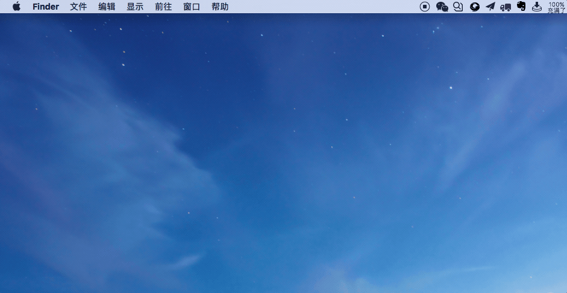
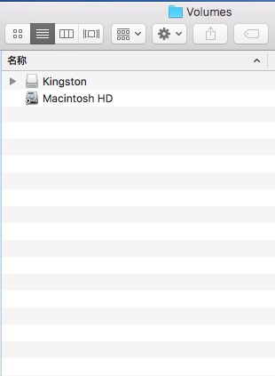

## 如何在macOS-Sierra上不使用第三方软件写入NTFS的U盘

在macOS上，默认NTFS格式的u盘是不能写入的，那么通过以下方法，不用借助第三方软件即可写入NTFS格式的U盘（当然，也可能会失败，Good luck for you ^_^ or keep trying）

- 将U盘插入mac，待mac识别U盘后，查看U盘的名称（尽量使用英文名称），比如我的u盘名字叫 Kingston

- 打开终端，输入以下命令后回车，输入你的密码，回车

```shell
sudo nano /etc/fstab
```

- 进入GNU nano后，复制以下文本到GNU nano里

```
LABEL=你U盘的名字 none ntfs rw,auto,nobrowse
```

注意，将'你U盘的名字'替换为U盘的名称

- 复制完上述文本之后，ctrl+o保存文件，回车，然后ctrl+x退出

- 拔掉你的U盘，然后重新插入，（这个时候你看不到你的U盘挂载），通过Finder -> 前往 -> 前往文件夹 -> /Volumes，即可看到你的U盘了，试试是否可以拷贝文件？^_^

- GIF 操作演示




